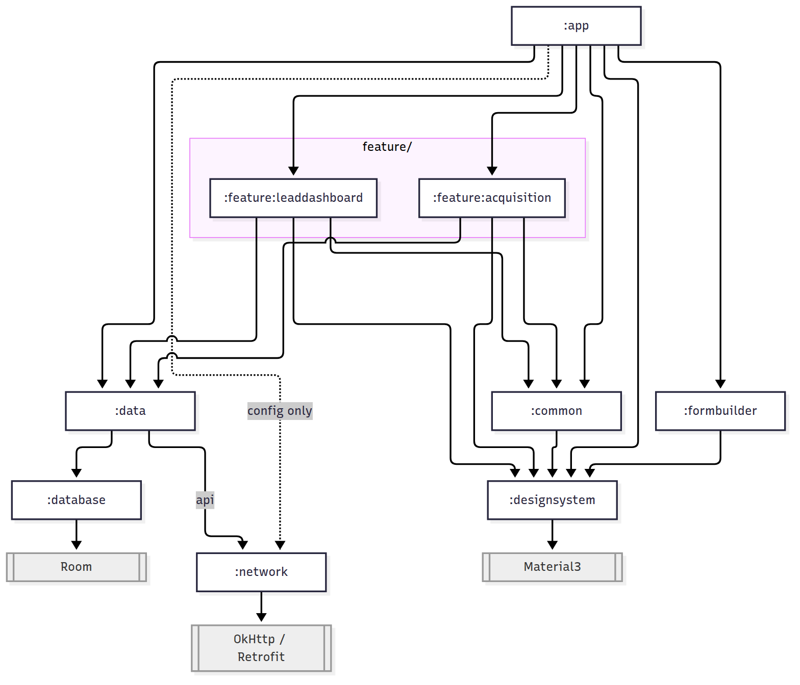

# ComposeForm

ComposeForm renders a fully interactive form from a JSON schema — no per-screen Compose UI code needed. You write (or fetch from an API) a JSON document describing fields, options, styling, layout, and conditional visibility; `parseFormSchema` turns it into a `FormSchema`, and `FormRenderer` draws it.

## Quick start

```kotlin
val schema = parseFormSchema(jsonString)

FormRenderer(
    schema = schema,
    onSubmit = { values -> /* Map<String, FormValue> of submitted data */ },
)
```

`FormValue` is `Text(value)` / `Option(id, value)` / `Options(selected: List<Option>)` — to get the plain answered value per field instead of pattern-matching yourself, call `values.toPlainValues()` for a flattened `Map<String, String>` (or `formValue.toPlainString()` for a single one). See [`formbuilder/README.md`](formbuilder/README.md) for the full JSON schema reference.

## Modules

The project is split into eight Gradle modules:

| Module | Description | Docs |
|---|---|---|
| `:app` | The application shell — hosts Compose screens, the `@HiltAndroidApp` entry point, and the demo server-driven form flow (`DemoFormApi`) that exercises `:formbuilder`/`:network`. Not permitted to depend on Material3/Foundation or Square's networking libraries directly. | [`CLAUDE.md`](CLAUDE.md) |
| `:designsystem` | Owns all Material3-based UI. The only module allowed to depend on Material3/Foundation directly — everything else goes through its wrapped components (`AppText`, `AppButton`, `AppScaffold`, etc.). | [`designsystem/README.md`](designsystem/README.md) |
| `:formbuilder` | Parses a JSON form schema (`kotlinx.serialization`) and renders it using `:designsystem`'s components. | [`formbuilder/README.md`](formbuilder/README.md) |
| `:network` | Owns OkHttp/Retrofit and all raw API/network work — Retrofit service interfaces, DTOs, interceptors, the safe-call layer. The only module allowed to depend on Square's networking libraries directly. | [`network/README.md`](network/README.md) |
| `:data` | Owns the repository layer (`AppRepository`/`PaymentRepository`/`AnalyticsRepository`/`PartnerRepository`) — the actual thing screens inject, wrapping `:network`'s raw API calls. | [`data/README.md`](data/README.md) |
| `:common` | Small Compose UI helpers shared by more than one feature screen, so feature modules never depend on each other or back on `:app`. | [`CLAUDE.md`](CLAUDE.md) |
| `:feature:leaddashboard` | The lead dashboard screen, end to end. | [`CLAUDE.md`](CLAUDE.md) |
| `:feature:acquisition` | The acquisition approval list and detail/decision flow, end to end. | [`CLAUDE.md`](CLAUDE.md) |

### Dependency graph



Arrows point from a module to what it depends on. Grey boxes are external libraries, each reachable from exactly one module — the compiler-enforced boundaries. `:data`'s dependency on `:network` is `api`, so feature modules see `:network`'s result/model types through `:data` without depending on `:network` themselves; `:app`'s direct `:network` dependency exists only to configure it (base URLs, token storage), not to fetch data. `:database` (on-device storage) is planned and not created yet — it's drawn here where it will slot in. The image is rendered from [`docs/module-graph.mmd`](docs/module-graph.mmd) (regeneration command inside), not drawn by hand.

See [`CLAUDE.md`](CLAUDE.md) for the full architecture, build/test commands, and the compiler-enforced module boundaries.
